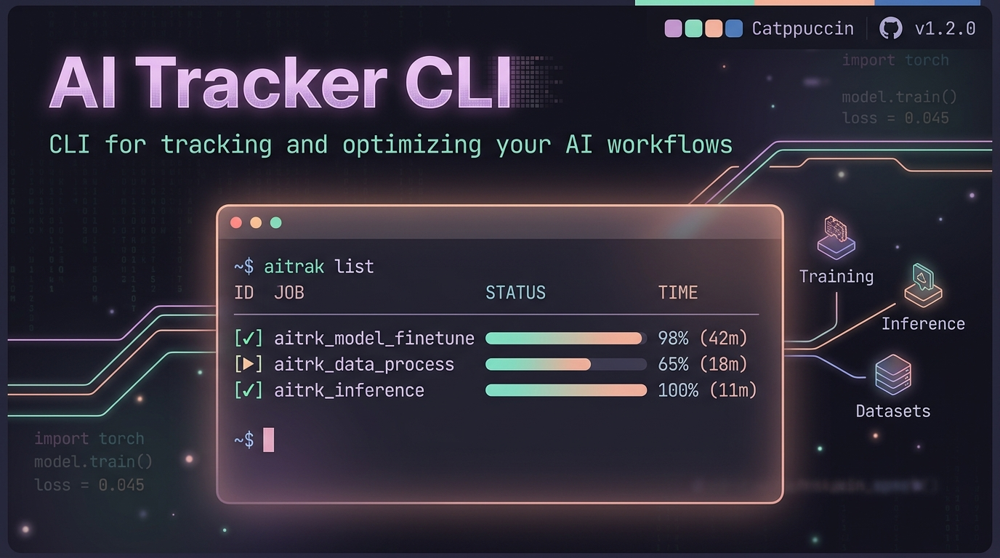

<div align="center">
  
  
  <h1>ai-tracker</h1>
  <p><strong>Passive Log-Tailing Analytics Dashboard for Local AI Agents</strong></p>
  
  [](https://goreportcard.com/report/github.com/spencer-life/ai-tracker)
  [](https://opensource.org/licenses/MIT)
  
  Tags: `golang`, `cli`, `ai`, `dashboard`, `tui`, `catppuccin`, `bubbletea`, `tailwindcss`, `wal-mode`, `redaction`
</div>

---

## 🚀 Overview

`ai-tracker` (`ait`) is a hyper-fast, zero-friction CLI tool and local web dashboard designed for monitoring local AI agent usage across multiple platforms:
- **Claude Code** (`~/.claude/`)
- **Antigravity** (`~/.gemini/antigravity-cli/brain/`)
- **Codex** (`~/.codex/`)

It passively tails telemetry JSON logs using Go concurrency, extracts token metrics, computes "Shadow API Costs" instantly, and wraps it in a premium **Catppuccin Frappe** visual design.

---

## ✨ 2.0 Enterprise Features

- 🔌 **Real-Time WebSocket Engine**: Streams log telemetry instantly to the dashboard.
- 🚀 **Byte-Offset Cursor Tracking**: O(1) sync times using file offset caching instead of hashing.
- 📦 **Offline-First Embedded Dashboard**: Uses `go:embed` to serve Tailwind and GSAP without external CDN requests.
- 🔐 **Safe Structural Redaction:** Sanitizes JSON values after parsing, preserving structural integrity.


- 🔐 **Secret Redaction Engine:** Built-in security layer that automatically sanitizes sensitive credentials (JWTs, Anthropic API keys `sk-ant-api*`, AWS keys `AKIA*`, Doppler tokens `dp.pt.*`) before logs are stored or processed.
- ⚡ **High-Concurrency SQLite WAL Mode:** Uses SQLite Write-Ahead Logging (`PRAGMA journal_mode=WAL`) to allow concurrent background log ingestion while serving dashboard queries without lock contention.
- 🌐 **Embedded Web Dashboard:** Single Go binary serving a responsive Tailwind + GSAP + Lenis web interface (`ait dashboard`), featuring a `--open` flag for instant browser launch.
- 💻 **Terminal UI (TUI):** Interactive Bubbletea terminal interface (`ait tui`) for rapid, keyboard-driven telemetry checks inside your terminal.
- 🔄 **Continuous Ingestion Daemon:** Daemon watch mode (`ait sync --watch` / `ait sync -w`) that polls for new agent log activity every 5 seconds.
- 📦 **Multi-Format Export & Date Filtering:** Rich data export capabilities (`ait export`) supporting JSON, CSV, compressed `.zip` archives, and granular date filters (`--from`, `--to`, `--days`).
- 🧹 **Database Management & Info:** Quick database reset (`ait clean`) and version inspection (`ait version`).

---

## 🛠️ Usage & CLI Reference

### 1. Launch Web Dashboard
Starts the Catppuccin-themed web dashboard and telemetry REST API (`/api/v1/telemetry`).

```bash
# Start server at http://127.0.0.1:8080
ait dashboard

# Automatically open the dashboard in your default web browser
ait dashboard --open

# Run on a custom host or port
ait dashboard --host 0.0.0.0 --port 9090
```

### 2. Interactive Terminal UI (TUI)
Launch the Bubbletea TUI for keyboard-driven analysis.

```bash
ait tui
```

### 3. Sync Agent Logs (Daemon & One-Shot Mode)
Parse local log files and populate the database.

```bash
# One-shot sync of all agent logs
ait sync

# Daemon mode: continuously watch logs every 5 seconds
ait sync --watch
# or
ait sync -w
```

### 4. Export Telemetry Data
Export token logs in JSON or CSV format, with optional ZIP compression and date filtering.

```bash
# Export all records to JSON stdout
ait export --json

# Export to CSV formatted file
ait export --csv --out telemetry.csv

# Export data from the last 7 days to a compressed ZIP archive
ait export --days 7 --csv --out usage-report.zip

# Filter by date range (YYYY-MM-DD or RFC3339 timestamp)
ait export --from 2026-07-01 --to 2026-07-22 --json --out july_report.json

# Filter by specific AI agent
ait export --agent antigravity --json
```

### 5. Database Cleanup & Maintenance
Safely wipe all ingested telemetry logs from the local SQLite database (`~/.config/ai-tracker/data.db`).

```bash
ait clean
```

### 6. Version Info
Display the current binary version of `ai-tracker`.

```bash
ait version
```

---

## 🔒 Secret Redaction Engine

`ai-tracker` prioritizes log privacy. Before any raw telemetry line is processed or stored in SQLite, `ingest.RedactSecrets()` pattern-matches and replaces sensitive keys with `[REDACTED]`:

| Pattern / Key Type | Example Matched Format |
|---|---|
| **Anthropic API Keys** | `sk-ant-api*` |
| **JSON Web Tokens (JWT)** | `eyJ...` |
| **AWS Access Key ID** | `AKIA*` |
| **Doppler Service Tokens** | `dp.pt.*` |

---

## ⚡ High-Concurrency Ingestion (SQLite WAL)

`ai-tracker` uses embedded `modernc.org/sqlite` with tuned PRAGMAs:
```sql
PRAGMA journal_mode=WAL;
PRAGMA busy_timeout=5000;
PRAGMA synchronous=NORMAL;
```
This enables simultaneous background log ingestion (`ait sync --watch`) alongside active queries from the REST API (`ait dashboard`) or CLI without encountering `database is locked` errors.

---

## 🎨 Theme & Branding

Designed with the **Catppuccin Frappe** color palette for optimal visual comfort in both terminal and web interfaces.

---

## 📄 License

[MIT](LICENSE) © Innovative Business Solutions

