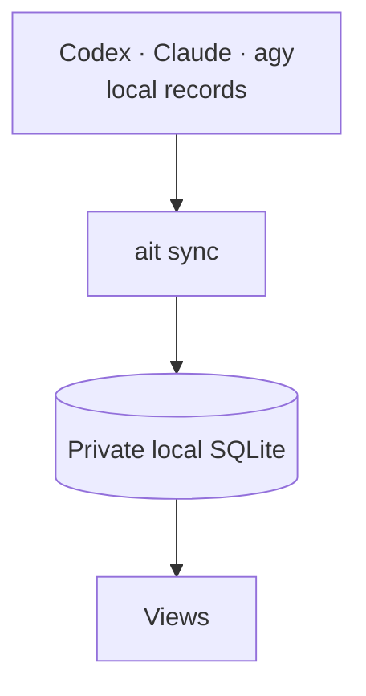
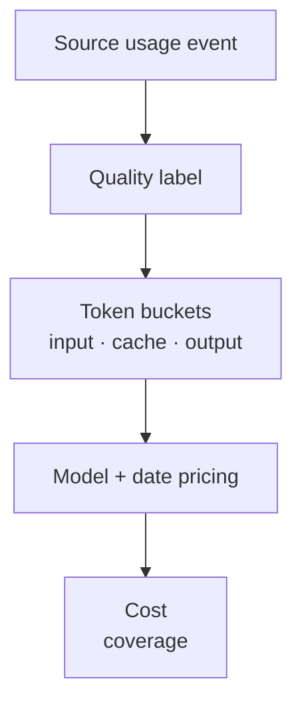

# AI Tracker

[](https://github.com/spencer-life/ai-tracker/actions/workflows/ci.yml)
[](https://github.com/spencer-life/ai-tracker/releases/latest)
[](LICENSE)

[](https://github.com/tandpfun/skill-icons)

`ait` turns local Codex, Claude Code, and Antigravity (`agy`) records into source-backed session, token, model, quality, and API-equivalent cost analytics. Missing telemetry is never replaced with fake data.

## Install

Choose whichever method fits your setup.

### mise

Recommended if you already use [mise](https://mise.jdx.dev):

```bash
repo=spencer-life/ai-tracker
mise use -g \
  "github:$repo@latest"
mise reshim
ait version
```

### Go

With Go 1.26.5 or newer:

```bash
repo=spencer-life/ai-tracker
go install \
  "github.com/$repo@latest"
ai-tracker version
```

Go installs the canonical `ai-tracker` executable, but not the optional Codex skill. It goes to `$GOBIN` when set, otherwise `$(go env GOPATH)/bin`. Use `ai-tracker` anywhere this README shows the release shortcut `ait`.

### Release archive

[Download the latest release](https://github.com/spencer-life/ai-tracker/releases/latest) for Linux/WSL or macOS on x86-64 or ARM64. Each archive includes both `ait` and `ai-tracker`, plus the optional Codex skill; [all releases](https://github.com/spencer-life/ai-tracker/releases) and `checksums.txt` are available on GitHub.

Verify the archive with `checksums.txt`, extract it, and place `ait` and `ai-tracker` in a directory on `PATH`, such as `~/.local/bin`.

Windows users should run the Linux release inside WSL.

## Quick start

Import local history, then open the browser dashboard:

```bash
ait sync
ait dashboard
```

The browser opens at `http://127.0.0.1:8080`. It stays loopback-only because it has no authentication.

## How it works



The source records remain authoritative. AI Tracker stores normalized telemetry locally so every interface reads the same data.

## Common commands

- **Browser dashboard:** `ait dashboard`
- **Terminal dashboard:** `ait tui`
- **30-day summary:** `ait usage --range 30d`
- **Recent Codex sessions:** `ait sessions --range 30d --agent codex`
- **Daily JSON series:** `ait daily --range 7d --json`
- **Data health:** `ait doctor`
- **Skills, hooks, and agents:** `ait inventory`
- **Private CSV export:** `ait export --range 30d --csv --out usage.csv`

<details>
<summary>Open the dashboard on a phone through an SSH tunnel</summary>

Start the server in WSL:

```bash
ait dashboard \
  --host 127.0.0.1 \
  --port 8080
```

In Termius or another SSH client, forward client-local port `8080` to destination `127.0.0.1:8080`, then open `http://127.0.0.1:8080` on the client device.

</details>

## Accuracy and coverage

- **Codex:** reported tokens from the active configured/Desktop store plus the distinct native WSL archive. Same-named copied rollouts are deduplicated.
- **Claude Code:** reported assistant usage, including cache-read and cache-creation tokens.
- **agy:** session metadata by default. Character-derived transcript estimates require explicit `--include-estimates` opt-in.

Every usage event is labelled `reported`, `derived`, `estimated`, or `legacy`. Estimated usage is excluded unless requested.

## Cost model



- Input, cache read, cache write, output, and reasoning are tracked separately.
- Missing models or token splits are never invented.
- Unknown-price events remain unpriced instead of being treated as free.
- Totals are standard API-equivalent estimates—not subscription invoices.
- Priority/fast tiers, storage, tools, and plan fees are excluded.

<details>
<summary>Pricing catalog and limitations</summary>

The offline catalog includes observed aliases for OpenAI/Codex models, Claude Opus 5, Fable 5, Sonnet 5 and 4.x models, Gemini 3.6 Flash, and Gemini 3.1 Pro. It preserves Claude cache-write durations, verified long-context tiers, and date-aware pricing. Rebuild after a pricing update to reprice source events.

Pricing was checked on 2026-07-25 against [OpenAI](https://developers.openai.com/api/docs/models), [Anthropic](https://platform.claude.com/docs/en/about-claude/pricing), [Gemini](https://ai.google.dev/gemini-api/docs/pricing), and [ccusage v20.0.18](https://github.com/ccusage/ccusage/blob/v20.0.18/rust/crates/ccusage/src/pricing.rs).

</details>

## Storage and privacy

**Stored locally:** token categories, timestamps, model, quality, session relationships, and hashed identifiers.

**Never stored:** prompts, transcript text, hook commands, environment values, or full source paths.

The default database is `~/.config/ai-tracker/data.db`; set `AIT_DATA_DIR` to relocate it. Data and backup directories use mode `0700`; databases, backups, and exports use `0600` on Linux/WSL and macOS.

Legacy v1 migration, `sync --rebuild`, and `clean --yes` create a timestamped backup before changing or clearing data. Inventory reads bounded metadata from global configuration and the current repository ancestry; it never executes discovered components.

## Command reference

<details>
<summary>Sync and repair</summary>

```bash
ait sync
ait sync --watch
ait sync --rebuild
ait sync --include-estimates
ait doctor --json
```

Coming from v1.0.0? Run one `ait sync --rebuild` after upgrading. It backs up the existing database before rebuilding it.

</details>

<details>
<summary>Reports and filters</summary>

```bash
ait usage --range 30d
ait daily --range 7d \
  --tz America/Phoenix \
  --json
ait weekly --range mtd --json
ait monthly --range custom \
  --from 2026-01-01 \
  --to 2026-07-01 \
  --json
ait sessions --range 30d \
  --agent codex
```

Reports accept `--range today|7d|30d|mtd|custom`, `--from`, `--to`, `--tz`, `--agent`, `--provider`, `--model`, `--quality`, `--include-estimates`, `--limit`, and `--json`. Ranges are half-open; weeks start Monday.

</details>

<details>
<summary>Exports and interfaces</summary>

```bash
ait export --range 7d
ait export --range 30d --csv \
  --out usage.csv
ait export --agent claude \
  --csv --out claude.zip
ait tui
ait dashboard --open
ait dashboard --port 9090 \
  --no-sync
```

Exports use mode `0600`; a `.zip` suffix creates a compressed archive. The loopback dashboard exposes `/api/v2` and committed-sync events at `/api/v2/events`.

</details>

Run `ait <command> --help` for the complete command surface.

## Updates and Codex skill

<details>
<summary>Manage a mise installation</summary>

Update:

```bash
repo=spencer-life/ai-tracker
mise upgrade \
  "github:$repo"
mise reshim
```

Remove:

```bash
repo=spencer-life/ai-tracker
mise use -g --remove \
  "github:$repo"
mise uninstall \
  "github:$repo"
```

</details>

<details>
<summary>Install the bundled Codex skill</summary>

Copy `skills/ai-tracker` from a release archive to `$CODEX_HOME/skills/ai-tracker`, then restart Codex.

</details>

`ai-tracker` is the canonical binary name; release archives and mise also provide the shorter `ait` wrapper.

## Development and releases

```bash
mise run build
mise run test
mise run lint
```

CI and release verification run tests, the race detector, `go vet`, linting, wrapper checks, and release-archive checks with read-only default permissions. Maintainers should follow [RELEASING.md](RELEASING.md); tag publishing occurs only after verification succeeds.

## License

[MIT](LICENSE) © Innovative Business Solutions
