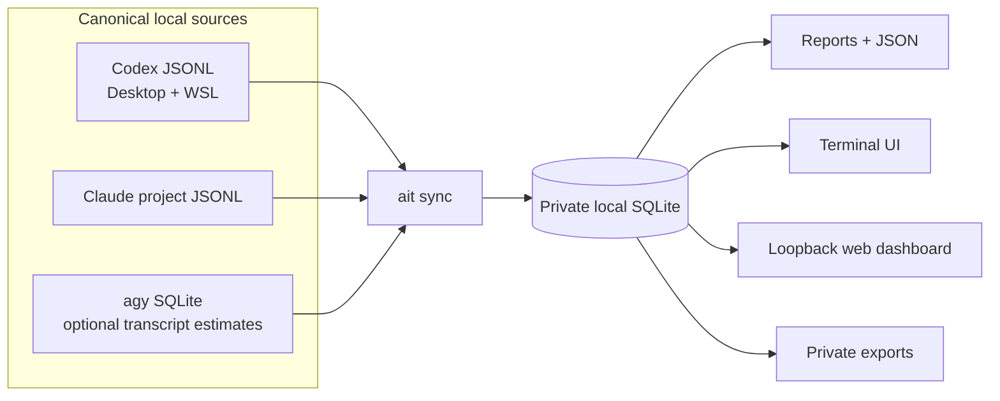
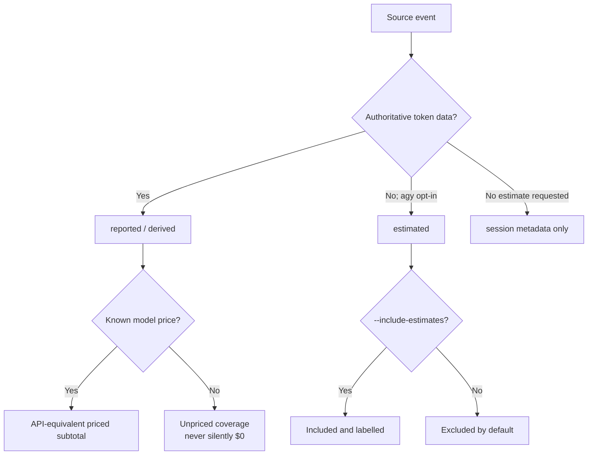

# AI Tracker

[](https://github.com/spencer-life/ai-tracker/actions/workflows/ci.yml)
[](https://github.com/spencer-life/ai-tracker/releases/latest)
[](LICENSE)

`ait` turns local Codex, Claude Code, and Antigravity (`agy`) records into source-backed session, token, model, quality, and API-equivalent cost analytics—without inventing missing telemetry.

## Quick start

### Install with mise

```bash
mise use -g github:spencer-life/ai-tracker@v1.1.1
mise reshim
ait version
```

### Install the release binary without mise

Linux/WSL x86-64:

```bash
archive=ai-tracker_Linux_x86_64.tar.gz
curl -fLO "https://github.com/spencer-life/ai-tracker/releases/latest/download/$archive"
curl -fLO https://github.com/spencer-life/ai-tracker/releases/latest/download/checksums.txt
grep "  $archive$" checksums.txt | sha256sum -c -
tar -xzf "$archive"
mkdir -p ~/.local/bin
install -m 0755 ai-tracker ait ~/.local/bin/
export PATH="$HOME/.local/bin:$PATH"
ait version
```

Use `ai-tracker_Linux_arm64.tar.gz`, `ai-tracker_Darwin_x86_64.tar.gz`, or `ai-tracker_Darwin_arm64.tar.gz` for other supported systems. On macOS, replace the checksum line with:

```bash
grep "  $archive$" checksums.txt | shasum -a 256 -c -
```

Then import your local history and open a view:

```bash
ait sync
ait dashboard
```

`ai-tracker` remains available as the canonical compatibility command. Upgrading from v1.0.0 requires one `ait sync --rebuild`; it creates a timestamped backup before rebuilding.

## How it works



## Choose a view

| Goal | Command |
| --- | --- |
| Browser dashboard | `ait dashboard` |
| Terminal dashboard | `ait tui` |
| 30-day summary | `ait usage --range 30d` |
| Recent Codex sessions | `ait sessions --range 30d --agent codex` |
| Daily JSON series | `ait daily --range 7d --json` |
| Data health | `ait doctor` |
| Skills, hooks, and agents | `ait inventory` |
| Private CSV export | `ait export --range 30d --csv --out usage.csv` |

For mobile access through an SSH tunnel, run `ait dashboard --host 127.0.0.1 --port 8080`, forward client-local port `8080` to destination `127.0.0.1:8080`, then open `http://127.0.0.1:8080` on the client device. The dashboard intentionally rejects non-loopback listeners because it has no authentication.

## Sources and coverage

| Source | Sessions | Tokens | Notes |
| --- | --- | --- | --- |
| Codex | Yes | Reported | Active configured/Desktop store plus distinct native WSL archive; same-named rollout copies are deduplicated |
| Claude Code | Yes | Reported | Assistant usage records, including cache-read and cache-creation tokens |
| agy | Yes | Not authoritative | Character-derived transcript estimates require explicit `--include-estimates` opt-in |

Every event is labelled `reported`, `derived`, `estimated`, or `legacy`. Estimated usage is excluded unless requested.

## Trust and cost model



- Missing models and token splits are never fabricated.
- Uncached input, cache read, cache write, and output are priced separately; reasoning is not billed twice.
- Unknown-price events remain unpriced and appear in coverage instead of being treated as free.
- Totals are standard API-equivalent estimates—not subscription invoices. Priority/fast tiers, storage, tools, and plan fees are excluded.

The offline snapshot covers current observed OpenAI/Codex models, Claude Opus 5, Fable 5, Sonnet 5 and 4.x models, Gemini 3.6 Flash (including agy's `-high` alias), Gemini 3.1 Pro, and selected older models. It preserves Claude cache-write durations, verified long-context tiers, and date-aware pricing. Rebuild after pricing updates to reprice source events.

Pricing was checked on 2026-07-25 against [OpenAI](https://developers.openai.com/api/docs/models), [Anthropic](https://platform.claude.com/docs/en/about-claude/pricing), [Gemini](https://ai.google.dev/gemini-api/docs/pricing), and [ccusage v20.0.18](https://github.com/ccusage/ccusage/blob/v20.0.18/rust/crates/ccusage/src/pricing.rs).

## Storage and privacy

| Stored locally | Never stored |
| --- | --- |
| Token categories, timestamps, model, quality, session relationships, and hashed identifiers | Prompts, transcript text, hook commands, environment values, and full source paths |

The default database is `~/.config/ai-tracker/data.db`; set `AIT_DATA_DIR` to relocate it. Data and backup directories use mode `0700`; databases, backup files, and exports use `0600` on Linux/WSL and macOS.

Legacy v1 migration creates a timestamped backup before changing tables. `sync --rebuild` and `clean --yes` back up before clearing data. Inventory reads bounded metadata from global configuration and the current repository ancestry; it never executes discovered components.

## Command reference

<details>
<summary>Sync and repair</summary>

```bash
ait sync
ait sync --watch
ait sync --rebuild
ait sync --include-estimates
ait doctor --json
```

</details>

<details>
<summary>Reports and filters</summary>

```bash
ait usage --range 30d
ait daily --range 7d --tz America/Phoenix --json
ait weekly --range mtd --json
ait monthly --range custom --from 2026-01-01 --to 2026-07-01 --json
ait sessions --range 30d --agent codex
```

Reports accept `--range today|7d|30d|mtd|custom`, `--from`, `--to`, `--tz`, `--agent`, `--provider`, `--model`, `--quality`, `--include-estimates`, `--limit`, and `--json`. Ranges are half-open; weeks start Monday.

</details>

<details>
<summary>Export and interfaces</summary>

```bash
ait export --range 7d
ait export --range 30d --csv --out usage.csv
ait export --agent claude --csv --out claude.zip
ait tui
ait dashboard --open
ait dashboard --port 9090 --no-sync
```

Exports use mode `0600`; a `.zip` suffix creates a compressed archive. The loopback dashboard exposes `/api/v2` and committed-sync events at `/api/v2/events`.

</details>

Run `ait <command> --help` for the complete command surface.

## Installation, updates, and skill

Release archives support Linux/WSL and macOS on x86-64 and ARM64. Windows users run the Linux binary inside WSL.

```bash
mise upgrade github:spencer-life/ai-tracker
mise reshim
```

<details>
<summary>Remove a mise-managed installation</summary>

```bash
mise use -g --remove github:spencer-life/ai-tracker
mise uninstall github:spencer-life/ai-tracker
```

</details>

Each archive includes the AI Tracker Codex skill. Copy `skills/ai-tracker` to `$CODEX_HOME/skills/ai-tracker`, then restart Codex. Mise's GitHub backend discovers both executable files in the release root; see its [binary discovery documentation](https://mise.jdx.dev/dev-tools/backends/github.html#bin-path).

## Development and releases

```bash
mise run build
mise run test
mise run lint
```

CI and release verification run tests, the race detector, `go vet`, linting, wrapper checks, and release-archive checks with read-only default permissions. Maintainers should follow [RELEASING.md](RELEASING.md); tag publishing occurs only after verification succeeds.

## License

[MIT](LICENSE) © Innovative Business Solutions
